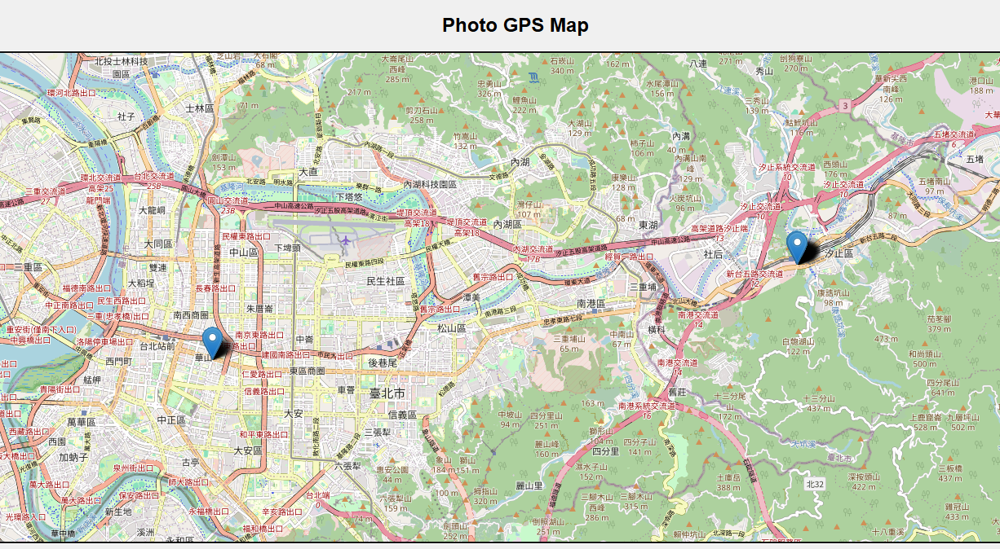
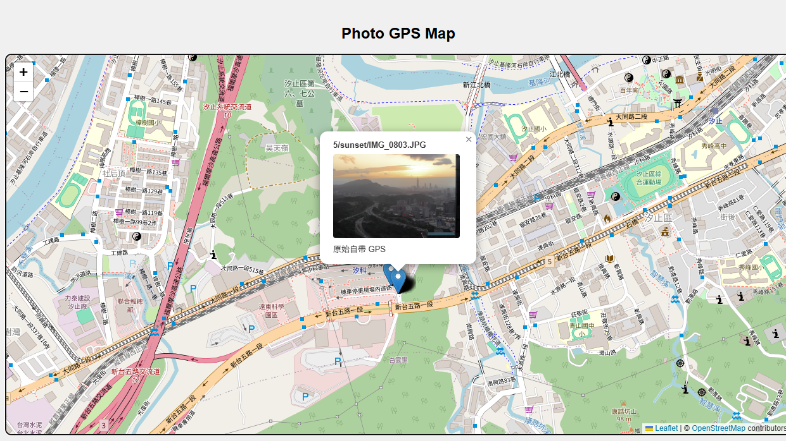

# 🌍 Photo GPS Auto-Synchronizer
*中文說明請往下捲動*

An automation tool designed for massive photo libraries (such as Immich, Synology Photos, or personal NAS backups). When you use a camera without built-in GPS (e.g., DSLR, mirrorless), this program automatically interpolates and assigns precise GPS coordinates to your photos using either "smartphone photos taken in the same period" or "Google Maps Timeline records".




## ✨ Core Features
* **⚡ Lightning-Fast Matching**: Uses binary search algorithms to find matching points among tens of thousands of photos in just seconds.
* **🌐 Multilingual Support**: Built-in English/Chinese switching, with all text extracted to `config.json` for easy expansion.
* **🖼️ Interactive Map Preview**:
  * Adopts **Lazy Loading** technology. Map pins only load photos when clicked, ensuring smooth performance even with 100,000 photos.
  * The generated web map is saved independently (~1MB) for easy portability and showcasing.
* **💾 Robust Resumable Progress**:
  * **Step 1 Scan**: Caches library status to avoid redundant disk reads.
  * **Step 2 Match**: Saves match plans for review before execution.
  * **Step 3 Write**: Records write progress, automatically resuming after crashes or restarts.
* **🧹 Safe Undo**: Made a mistake? One-click clear removes GPS data *only* from the current matched batch, without harming originally GPS-tagged photos.
* **🖥️ Dual Mode (WebUI & CLI)**: Offers a user-friendly Gradio web interface alongside a powerful Command Line Interface for batch processing.

## 📍 GPS Matching Methods
### Method A: Photos taken by Smartphone in the same period
Simply place photos taken by GPS-enabled devices (like your smartphone) in the same directory as your camera photos. The program will automatically identify them as reference points and assign GPS coordinates to temporally adjacent non-GPS photos.

### Method B: Google Maps Timeline (JSON)
The program supports reading Google Maps Timeline data. Due to recent Google privacy policy updates, timeline data is now primarily stored on your "mobile device" (keeping ~1 year of data by default).

**How to export from your smartphone (🌟 Recommended):**
1. Open the **Google Maps** App.
2. Tap your **Profile Picture** at the top right -> **"Your Timeline"**.
3. Tap the **"Three Dots (⋯)"** -> **"Settings and Privacy"**.
4. Scroll to "Location settings" -> **"Export Timeline data"**.
5. Transfer the generated `.json` file to your PC.
6. In the WebUI, select "Google Timeline Import" and load this file.

## 🛠️ Quick Start
**For General Users (Windows):**
Simply download the project, ensure you have Python installed, and double-click `start.bat`. It will automatically set up the virtual environment, install dependencies, and launch the WebUI.

**For Developers / CLI Users:**

```bash
pip install -r requirements.txt
python main.py --cli --dir "Y:\Photos" --tolerance 1800
```

## ⚙️ System Requirements
* **Operating System**: Windows (Currently tested on Windows 10/11 only)
* **Python**: 3.8 or higher
* **RAM**: Minimum 2GB (8GB+ recommended for large photo libraries)
* **Disk Space**: Depends on photo library size + ~500MB for dependencies
* **Other**: Exiftool (included in requirements.txt)

**Note**: *This project is currently only tested and verified on Windows. While the Python code may be compatible with macOS and Linux, the `.bat` startup scripts and file path handling are Windows-specific. Community contributions for cross-platform support are welcome.*

## ❓ FAQ
**Q: Will this damage my original photos?**
A: No. The program reads EXIF data and writes GPS coordinates only. Original files are backed up, and you can use the `--clear` command to remove added GPS data without affecting original metadata.

**Q: How accurate are the GPS coordinates?**
A: Accuracy depends on the reference source. Smartphone GPS is typically within 5-20 meters. Google Timeline data varies but averages 20-100 meters. The program interpolates between reference points for time-matched photos.

**Q: Can I use this with RAW files?**
A: Yes! The program works with any format that stores EXIF data (JPG, PNG, RAW, etc.).

**Q: What if I have thousands of photos?**
A: The program uses binary search algorithms and lazy loading for the map. Performance is optimized for 100,000+ photos.

**Q: Can I undo the GPS matching?**
A: Yes. The `--clear` command removes GPS data from the current batch. Resumable progress tracking is saved at each step.

## 🤝 Contributing
Contributions are welcome! Areas of interest:
* Cross-platform support (macOS/Linux)
* Additional GPS source methods
* Performance optimizations
* Bug fixes and feature requests

Please open an issue or submit a pull request on GitHub.

## 📜 License
This project is licensed under **GPL v3.0** - see [LICENSE](LICENSE) file for details.

In summary, you are free to use, modify, and distribute this software, but you must:
* Disclose the source code when distributing
* Use the same GPL v3.0 license for derivative works
* Include license and copyright notices

## 📧 Support
If you encounter issues:
1. Check the FAQ above
2. Review existing GitHub issues
3. Provide detailed logs when reporting bugs (use `--log` flag for verbose output)
4. For feature requests, describe your use case


# 🌍 大規模照片 GPS 自動補齊系統 (Photo GPS Auto-Synchronizer)
這是一個專為處理巨量照片庫（如 Immich、Synology Photos、個人 NAS 備份）設計的自動化工具。
當你使用無 GPS 功能的相機（如單眼、微單）拍照時，本程式能透過「同一時間段內手機拍的照片」或「Google 地圖時間軸紀錄」，
自動為你的相機照片補上大致的 GPS 經緯度資訊。


# ✨ 核心亮點
⚡ 極速匹配：採用二分搜尋演算法，即使在數萬張照片中尋找匹配點也僅需數秒。

🌐 多國語系支援：內建中英文切換，文字全部抽離至 config.json，易於擴充。

🖼️ 互動式地圖預覽：

採用 延遲載入 (Lazy Loading) 技術，地圖大頭針僅在點擊時讀取照片，處理 10 萬張照片也不卡頓。

網頁版地圖獨立保存，大小僅約 1MB，方便攜帶與展示。

# 💾 完善的斷點續傳機制：

Step 1 掃描：快取圖庫狀態，避免重複讀取磁碟。

Step 2 匹配：儲存匹配計畫，方便調整參數前對照。

Step 3 寫入：記錄寫入進度，當機或重啟後可自動接續。

🧹 安全清除 (Undo)：發現寫錯了？一鍵清除「僅限本次匹配」的照片 GPS，不傷及原始照片資料。

🖥️ WebUI & CLI 雙模式：同時提供友善的 Gradio 網頁介面與強大的命令列批次處理功能。

# 📍 匹配方法說明
來源一：同一時間段內手機拍的照片
只要將同一時段使用其他裝置（如手機等包含 GPS 的設備）拍攝的照片放在同一個資料夾內，程式就會自動讀取並將其標示為基準點，接著配對時間接近的相機照片，賦予其 GPS。

來源二：如何取得 Google 地圖時間軸紀錄 (Timeline JSON)
本程式支援讀取 Google 地圖的時間軸資料。由於 Google 隱私政策更新，時間軸資料目前主要儲存於您的「行動裝置」上。請依照以下步驟匯出您的時間軸 .json 檔案（注意：如果沒有特別設定，手機大概只會保留一年左右的 GPS 紀錄）：

方法一：從手機端匯出（🌟 推薦，適用於最新版 Google 地圖）
這是目前最準確且保證能抓到最新足跡的方法。

打開手機上的 Google 地圖 (Google Maps) App。

點擊右上角的 個人頭像，選擇 「你的時間軸」。

點擊右上角的 「三個點 (⋯)」 圖示，選擇 「設定與隱私」。

向下滑動找到「位置設定」區塊，點擊 「匯出時間軸資料」。

系統會產生一個名為 Location History.json 或 Records.json 的檔案，請將這個檔案透過 Line、Email 或雲端硬碟傳送到你的電腦上。

在本程式的 WebUI 中，選擇「Google Timeline 匯入」，並選取這個 JSON 檔案即可。

方法二：透過 Google Takeout (匯出) 網頁版（適用於舊版備份）
如果你的時間軸資料尚未完全轉移到手機，或是你想一次下載好幾年的歷史紀錄，可以使用 Google 官方的匯出工具：

前往 Google Takeout (匯出) 網頁並登入你的 Google 帳號。

點擊清單最上方的 「取消全選」。

往下滾動找到 「定位紀錄 (時間軸)」 (Location History / Timeline)，並將其 打勾。

點擊該選項下方的「多種格式」，確認匯出格式設定為 JSON。

滑到頁面最底端點擊 「下一步」，接著點擊 「建立匯出作業」。

等待 Google 處理完成後（可能需要幾分鐘），下載 ZIP 壓縮檔。

解壓縮後，請進入資料夾尋找 Records.json 或是 Semantic Location History 資料夾內的月份 JSON 檔案，將其餵給本程式即可。

💡 提示： 本程式會自動解析 JSON 檔案內的 semanticSegments 或原生經緯度節點，只要是標準的 Google 匯出格式皆可順利讀取。

# 🛠️ 快速開始

**一般使用者 (Windows)：**
下載專案後，確認電腦已安裝 Python，直接點擊執行 `start.bat` 即可。腳本會自動建立虛擬環境、下載套件並啟動網頁介面。

**開發者 / 命令列 (CLI) 使用者：**

```bash
# 準備環境
pip install -r requirements.txt

# 啟動網頁介面
python main.py

# 基本匹配 (使用內部照片基準)
python main.py --cli --dir "Y:\\Photos" --tolerance 1800

# 使用 Google Timeline 匹配並自訂輸出目錄
python main.py --cli --dir "Y:\\Photos" --timeline "Y:\\timeline.json" --outdir "./my_data"

# 復原/洗掉寫入的 GPS 資訊
python main.py --cli --dir "Y:\\Photos" --clear
```

## ⚙️ 系統需求

* **作業系統**: Windows (目前僅在 Windows 10/11 上測試驗證)
* **Python**: 3.8 或更新版本
* **記憶體**: 最小 2GB (處理大量照片庫建議 8GB 以上)
* **磁碟空間**: 取決於照片庫大小 + ~500MB 套件空間
* **其他**: Exiftool (包含在 requirements.txt)

**重要說明**：*本專案目前僅在 Windows 上測試與驗證。雖然 Python 程式碼可能與 macOS 和 Linux 相容，但 `.bat` 啟動腳本與檔案路徑處理為 Windows 專用。歡迎社群貢獻跨平台支援！*

## ❓ 常見問題 (FAQ)

**Q: 這個程式會損傷我的原始照片嗎？**
A: 不會。程式只讀取 EXIF 資料並寫入 GPS 座標。你也可以使用 `--clear` 指令清除新增的 GPS 資訊，不影響原始中繼資料。建議第一次使用前先自行使用小批量照片備份後測試

**Q: GPS 座標的精準度如何？**
A: 精準度取決於參考資料來源。手機 GPS 通常誤差在 5-20 公尺內；Google 時間軸資料變異較大，平均 20-100 公尺。程式會在時間匹配的照片間進行內插計算。

**Q: 可以用 RAW 檔案嗎？**
A: 可以！程式相容任何儲存 EXIF 資料的格式（JPG、PNG、RAW 等）。

**Q: 如果我有幾千張照片呢？**
A: 程式採用二分搜尋演算法與延遲載入技術，最佳化處理 10 萬張以上的照片。

**Q: 我可以復原 GPS 配對嗎？**
A: 可以。`--clear` 指令會移除目前批次的 GPS 資訊。每個步驟都會記錄進度，支援斷點續傳。

## 🤝 貢獻指南

歡迎提出貢獻！感興趣的方向包括：
* 跨平台支援 (macOS/Linux)
* 額外的 GPS 來源方法
* 效能最佳化
* 臭蟲修正與功能要求

請在 GitHub 上開啟 Issue 或提交 Pull Request。

## 📜 授權條款

本專案採用 **GPL v3.0 授權** - 詳見 [LICENSE](LICENSE) 檔案。

簡述：你可以自由使用、修改與散佈本軟體，但必須：
* 散佈時公開原始碼
* 衍生作品採用相同的 GPL v3.0 授權
* 包含授權與著作權聲明

## 📧 技術支援

遇到問題時：
1. 查看上方常見問題
2. 查閱既有的 GitHub Issue
3. 回報臭蟲時提供詳細日誌 (使用 `--log` 旗標啟用詳細輸出)
4. 功能要求時請說明使用情景
